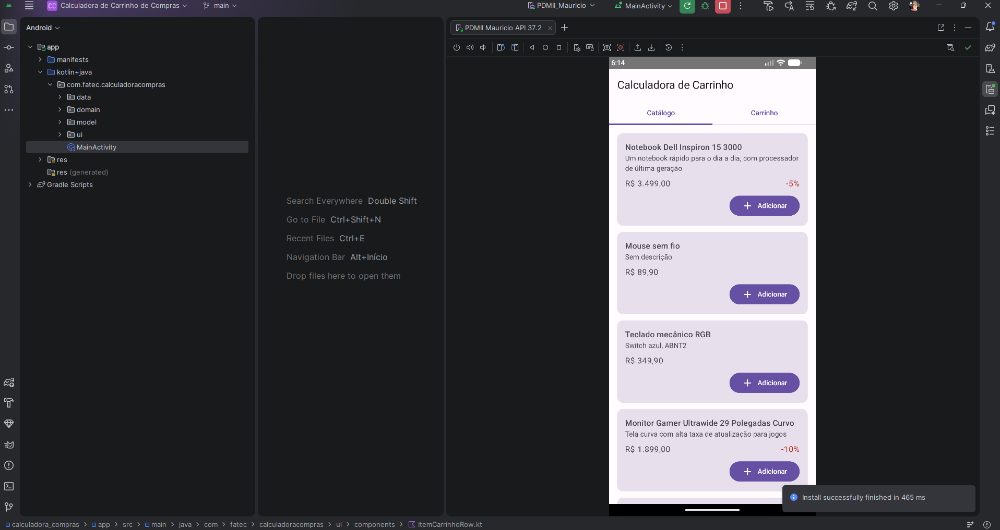
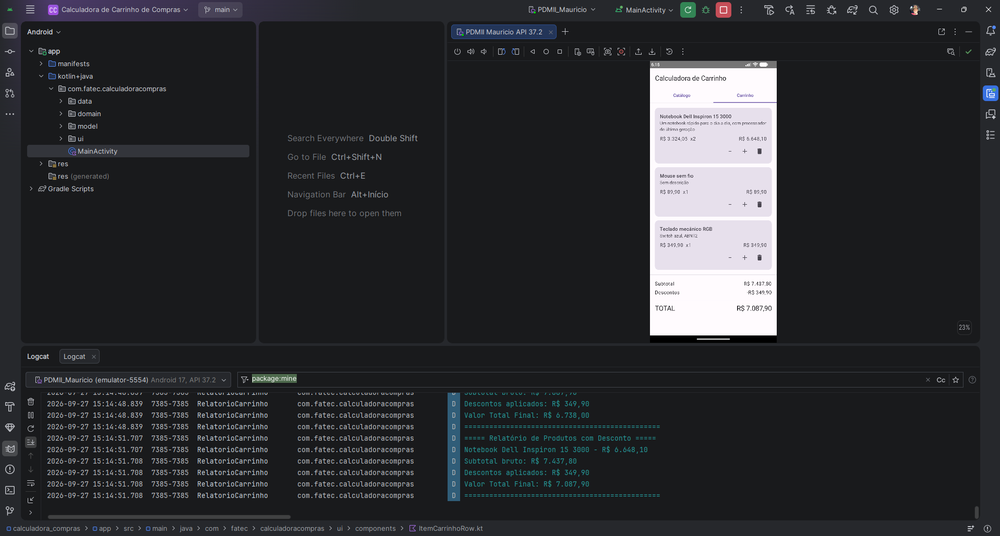
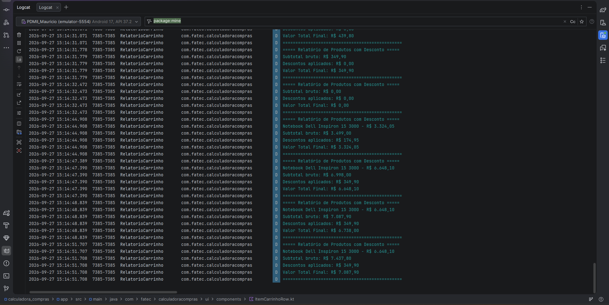

# Calculadora de Carrinho de Compras

**Nome completo:** Mauricio Rafael Gonçalves da Veiga

Aplicativo Android desenvolvido em Kotlin com Jetpack Compose para a disciplina da FATEC. Carrega um catálogo fixo de produtos, aplica regras de desconto, exibe o carrinho de compras parametrizado na tela e gera um relatório formatado no Logcat.

## Como abrir o projeto

1. Abra o Android Studio (Koala ou mais recente).
2. Selecione **Open** e escolha a pasta raiz deste repositório.
3. Se o Android Studio solicitar a criação do Gradle Wrapper, aceite (ou execute `gradle wrapper` uma vez com o Gradle 8.7 instalado).
4. Aguarde a sincronização do Gradle.
5. Rode o app em um emulador (`Run > Run 'app'`).

## Estrutura do projeto

```
app/src/main/java/com/fatec/calculadoracompras/
  model/        Produto, ItemCarrinho, Pagavel
  data/         Catálogo fixo de produtos
  domain/       Regras de cálculo (funções puras) e geração do relatório (Logcat)
  ui/           Tela do carrinho, componente reutilizável e tema Material 3
  MainActivity.kt
```

## Cenário de validação

O carrinho inicial carregado em `MainActivity` contém:

- Notebook Dell Inspiron 15 3000 — R$ 3.499,00 — desconto 5% — quantidade 2
- Mouse sem fio — R$ 89,90 — sem desconto — quantidade 1
- Teclado mecânico RGB — R$ 349,90 — sem desconto — quantidade 1

Resultado esperado exibido na tela:

- Subtotal bruto: R$ 7.437,80
- Descontos aplicados: R$ 349,90
- Valor Total Final: R$ 7.087,90

## Capturas de tela

**Emulador — aba Catálogo:**



**Emulador — aba Carrinho (cenário de validação):**



**Logcat — relatório de produtos com desconto:**



## Vídeo de apresentação

_< inserir link do YouTube (Não Listado) >_
